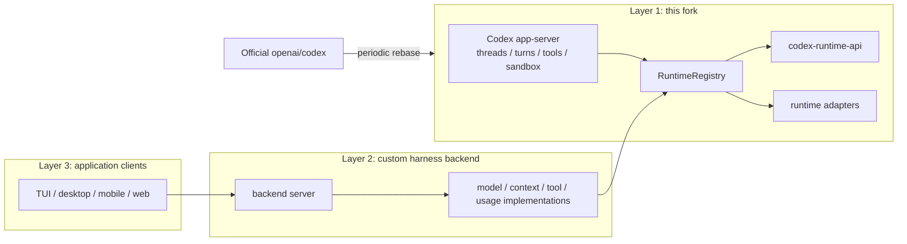

# Open Codex App-Server Foundation

This fork turns the Codex app-server into a reusable Layer 1 foundation for
custom agent harness backends.

The goal is to let downstream backends reuse Codex's thread, turn, tool,
sandbox, approval, event, and persistence machinery while installing their own
runtime behavior through narrow backend extension seams.

Upstream Codex already exposes a strong app-server protocol, MCP/plugin
integration, dynamic tool callbacks, and client-facing session APIs. Those
surfaces are enough for building clients and external tools, but they do not
make the internal model request, context assembly, tool-call repair, usage
mapping, or in-process app-server embedding path available as stable backend
extension points. A custom harness that needs those controls would otherwise
have to patch scattered core runtime code or move runtime policy into the
client.

This fork adds a small Layer 1 between upstream Codex and downstream harnesses:
it keeps app-server ownership of execution, but exposes selected runtime control
points through stable Rust APIs. The fork stays general-purpose:
DeepSeek-specific, Claude-specific, memory-product, or UI behavior belongs in
downstream Layer 2 and Layer 3 projects.

## Architecture



Codex app-server remains the owner of thread lifecycle, turn execution,
approval, sandbox, tool routing, event emission, and persistence. Layer 2 code
can opt into the new runtime surfaces to adapt model request bodies, contribute
and select context, observe final provider-bound input, repair tool calls, and
normalize usage metadata.

## What Changes

| Area                | Upstream Codex                                                                   | This Layer 1 fork                                                                                                         |
| ------------------- | -------------------------------------------------------------------------------- | ------------------------------------------------------------------------------------------------------------------------- |
| App-server protocol | Client-facing JSON-RPC for threads, turns, events, config, approvals, and tools. | Keeps the same app-server ownership model and adds SDK-friendly embedding.                                                |
| Tool extension      | MCP, plugins, and dynamic tool callbacks.                                        | Adds backend tool middleware for validation, repair, blocking, and result normalization before/after app-server dispatch. |
| Model provider path | Codex-owned request construction and transport.                                  | Adds request-body-level model adaptation while Codex still owns transport, auth, retries, and streaming.                  |
| Context path        | Codex-owned prompt/context assembly and history selection.                       | Adds bounded context contribution, context policy, and final provider-bound input observation.                            |
| Usage metadata      | Provider usage is handled inside Codex runtime paths.                            | Adds normalized usage/cache/reasoning metadata mapping for downstream harness logic.                                      |
| Embedding           | App-server is primarily consumed as a Codex runtime.                             | Adds `codex-app-server-sdk` so Layer 2 can start an in-process app-server with a custom runtime registry.                 |

- `codex-runtime-api`: stable boundary types and traits for runtime extension
  capabilities.
- `RuntimeRegistry`: the composition point for one active implementation per
  runtime capability.
- `codex-app-server-sdk`: an embedding path for building a Layer 2 app-server
  that still uses the existing Codex app-server runtime.
- Runtime take-effect tests and CI gates that prove custom context, model
  request, tool repair, and usage behavior flow through app-server.

With those additions, Layer 2 can implement capabilities that are awkward or
not cleanly possible against upstream Codex alone: provider-specific request
shaping for DeepSeek or Claude, cache-first context policy, memory/retrieval
insertion, final-context diagnostics, malformed tool-call repair, usage/cache
metadata normalization, and product-specific backend policy while keeping the
TUI, desktop, mobile, or web client thin.

## Reasonix-Style Examples

[DeepSeek-Reasonix](https://github.com/esengine/DeepSeek-Reasonix) is a useful
example of the kind of Layer 2 backend this fork is meant to support. Reasonix
markets itself around DeepSeek-native behavior such as a cache-first loop,
provider-aware configuration, MCP-first tools, and long-running terminal
sessions.

Some of those capabilities are already covered by upstream Codex surfaces:
clients can talk to app-server over JSON-RPC, external tools can come through
MCP/plugins, and app-server already owns approval and sandbox semantics. The
gap is the runtime behavior inside each model turn. These examples show the
kind of behavior a downstream DeepSeek-focused Layer 2 can add without moving
thread, tool, sandbox, approval, or persistence ownership out of app-server.

| Reasonix-style capability       | With upstream app-server only                                                                                                                                                           | With this Layer 1 fork                                                                                                                                 | Layer 2 example                                                                                                                                                                                                                     |
| ------------------------------- | --------------------------------------------------------------------------------------------------------------------------------------------------------------------------------------- | ------------------------------------------------------------------------------------------------------------------------------------------------------ | ----------------------------------------------------------------------------------------------------------------------------------------------------------------------------------------------------------------------------------- |
| Cache-first loop                | A client can append user messages and configure tools, but the final provider-bound context is assembled inside Codex. There is no stable API to keep the DeepSeek cache prefix fixed.  | `ContextContributor`, `ContextPolicy`, and `ContextAssemblyObserver` expose bounded context injection, history selection, and final-input observation. | Keep a byte-stable system/project/cache-prefix block at the front, append new turn items after it, inject bounded memory/retrieval items, and verify the assembled DeepSeek request still preserves the cacheable prefix.           |
| R1 thought/context harvesting   | A client can read emitted events, but cannot cleanly map provider-specific reasoning/cache metadata back into the next context policy.                                                  | Context policy and usage mapping become backend runtime capabilities instead of client-only heuristics.                                                | Summarize useful prior reasoning into a bounded internal memory fragment, keep the raw conversation append-only, and decide whether that fragment is included in the next turn based on token/cache policy.                         |
| Tool-call repair                | MCP/plugins/dynamic tools can execute, but malformed arguments are handled by the existing runtime path. A backend cannot centrally rewrite arguments before approval/sandbox dispatch. | `ToolMiddleware` can produce an effective call while preserving original/effective-call repair metadata.                                               | If DeepSeek emits `{path:"src", cmd:"ls"}` for a shell-style tool that expects `{command:"ls src"}`, repair the arguments, record the repair, then let app-server continue normal approval, sandbox, execution, and event emission. |
| DeepSeek/Claude request shaping | Codex owns model request construction and transport. A client cannot replace the provider request body shape from outside the turn runtime.                                             | `ModelRequestAdapter` works at request-body level while app-server still owns auth, transport, retries, and streaming.                                 | Build a DeepSeek Chat Completions body, a Claude Messages body, or another provider envelope from the same Codex turn input without forking the network/streaming stack.                                                            |
| Usage and cache accounting      | Provider usage is parsed inside Codex runtime paths, but cache hit/miss, cache creation tokens, or reasoning-token fields are not stable downstream policy inputs.                      | `UsageMetadataMapper` normalizes provider-specific usage/cache/reasoning metadata.                                                                     | Track DeepSeek prefix-cache savings, reasoning-token totals, and provider-specific cost policy, then expose those metrics to the Layer 2 backend or UI.                                                                             |
| Product-specific harness policy | Custom backend policy has to live either in the app client or in scattered patches to Codex runtime internals.                                                                          | `RuntimeRegistry` plus `codex-app-server-sdk` lets Layer 2 start an in-process app-server with one active implementation for each runtime capability.  | Ship a DeepSeek-specialized TUI or desktop backend that reuses Codex app-server for sessions and tool execution, while registering DeepSeek-specific model, context, tool repair, and usage behavior in one backend module.         |

For the detailed SDK path, see
[Building a Layer 2 app-server with the SDK](./docs/layer2-app-server-sdk.md).

## Upstream Codex

This fork is based on [OpenAI Codex](https://github.com/openai/codex), a local
coding agent that can run in your terminal, IDE, or desktop app.

To install upstream Codex CLI on Mac or Linux:

```shell
curl -fsSL https://chatgpt.com/codex/install.sh | sh
```

To install upstream Codex CLI on Windows:

```powershell
powershell -ExecutionPolicy ByPass -c "irm https://chatgpt.com/codex/install.ps1 | iex"
```

Codex CLI can also be installed with npm or Homebrew:

```shell
npm install -g @openai/codex
brew install --cask codex
```

Run `codex` to get started with the CLI, or run `codex app` for the desktop app
experience.

## Documentation

- [Layer 2 app-server SDK](./docs/layer2-app-server-sdk.md)
- [Upstream Codex documentation](https://developers.openai.com/codex)
- [Contributing](./docs/contributing.md)
- [Installing and building](./docs/install.md)

This repository is licensed under the [Apache-2.0 License](LICENSE).
