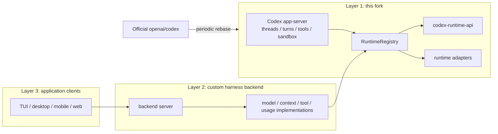

# Open Codex App-Server Foundation

This fork turns the Codex app-server into a reusable Layer 1 foundation for
custom agent harness backends.

The goal is to let downstream backends reuse Codex's thread, turn, tool,
sandbox, approval, event, and persistence machinery while installing their own
runtime behavior through narrow backend extension seams.

Upstream Codex already exposes a strong app-server protocol, MCP/plugin
integration, dynamic tool callbacks, and client-facing session APIs. Those
surfaces are enough for building clients and external tools, but they do not
make the internal model request, context assembly, tool-call repair, usage
mapping, or in-process app-server embedding path available as stable backend
extension points. A custom harness that needs those controls would otherwise
have to patch scattered core runtime code or move runtime policy into the
client.

This fork adds a small Layer 1 between upstream Codex and downstream harnesses:
it keeps app-server ownership of execution, but exposes selected runtime control
points through stable Rust APIs. The fork stays general-purpose:
DeepSeek-specific, Claude-specific, memory-product, or UI behavior belongs in
downstream Layer 2 and Layer 3 projects.

## Architecture



Codex app-server remains the owner of thread lifecycle, turn execution,
approval, sandbox, tool routing, event emission, and persistence. Layer 2 code
can opt into the new runtime surfaces to adapt model request bodies, contribute
and select context, observe final provider-bound input, repair tool calls, and
normalize usage metadata.

## What Changes

| Area                | Upstream Codex                                                                   | This Layer 1 fork                                                                                                         |
| ------------------- | -------------------------------------------------------------------------------- | ------------------------------------------------------------------------------------------------------------------------- |
| App-server protocol | Client-facing JSON-RPC for threads, turns, events, config, approvals, and tools. | Keeps the same app-server ownership model and adds SDK-friendly embedding.                                                |
| Tool extension      | MCP, plugins, and dynamic tool callbacks.                                        | Adds backend tool middleware for validation, repair, blocking, and result normalization before/after app-server dispatch. |
| Model provider path | Codex-owned request construction and transport.                                  | Adds request-body-level model adaptation while Codex still owns transport, auth, retries, and streaming.                  |
| Context path        | Codex-owned prompt/context assembly and history selection.                       | Adds bounded context contribution, context policy, and final provider-bound input observation.                            |
| Usage metadata      | Provider usage is handled inside Codex runtime paths.                            | Adds normalized usage/cache/reasoning metadata mapping for downstream harness logic.                                      |
| Embedding           | App-server is primarily consumed as a Codex runtime.                             | Adds `codex-app-server-sdk` so Layer 2 can start an in-process app-server with a custom runtime registry.                 |

- `codex-runtime-api`: stable boundary types and traits for runtime extension
  capabilities.
- `RuntimeRegistry`: the composition point for one active implementation per
  runtime capability.
- `codex-app-server-sdk`: an embedding path for building a Layer 2 app-server
  that still uses the existing Codex app-server runtime.
- Runtime take-effect tests and CI gates that prove custom context, model
  request, tool repair, and usage behavior flow through app-server.

With those additions, Layer 2 can implement capabilities that are awkward or
not cleanly possible against upstream Codex alone: provider-specific request
shaping for DeepSeek or Claude, cache-first context policy, memory/retrieval
insertion, final-context diagnostics, malformed tool-call repair, usage/cache
metadata normalization, and product-specific backend policy while keeping the
TUI, desktop, mobile, or web client thin.

## Reasonix-Style Examples

[DeepSeek-Reasonix](https://github.com/esengine/DeepSeek-Reasonix) is a useful
example of the kind of Layer 2 backend this fork is meant to support. Reasonix
markets itself around DeepSeek-native behavior such as a cache-first loop,
provider-aware configuration, MCP-first tools, and long-running terminal
sessions.

Some of those capabilities are already covered by upstream Codex surfaces:
clients can talk to app-server over JSON-RPC, external tools can come through
MCP/plugins, and app-server already owns approval and sandbox semantics. The
gap is the runtime behavior inside each model turn.

| Reasonix-style capability       | Why upstream app-server alone is not enough                                                                                                                                         | Layer 1 surface added by this fork                                    | What Layer 2 can implement                                                                                                                                 |
| ------------------------------- | ----------------------------------------------------------------------------------------------------------------------------------------------------------------------------------- | --------------------------------------------------------------------- | ---------------------------------------------------------------------------------------------------------------------------------------------------------- |
| Cache-first loop                | Upstream app-server owns context/history assembly, but does not expose stable hooks to keep selected prompt prefixes byte-stable for a provider cache strategy.                     | `ContextContributor`, `ContextPolicy`, and `ContextAssemblyObserver`. | Append-only or cache-stable context ordering, memory/retrieval insertion, final-context diagnostics, and provider-specific cache proof.                    |
| DeepSeek/Claude request shaping | Upstream app-server owns model request construction and transport; clients cannot cleanly swap the provider API envelope from outside.                                              | `ModelRequestAdapter` at request-body level.                          | Build DeepSeek, Claude Messages, Chat Completions, or other provider-shaped request bodies while Codex still owns auth, transport, retries, and streaming. |
| Tool-call repair                | Upstream tool execution supports MCP/plugins/dynamic tools, but does not expose a backend middleware seam for rewriting malformed tool arguments before approval/sandbox/execution. | `ToolMiddleware` with original/effective call metadata.               | Repair arguments, block unsafe calls, normalize results, and preserve call identity for audit and UI.                                                      |
| Usage and cache accounting      | Upstream usage is handled inside Codex runtime paths, but provider-specific cache/reasoning fields are not exposed as a stable downstream policy input.                             | `UsageMetadataMapper` and normalized runtime usage fields.            | Track cache hit/miss, cache token savings, reasoning token metadata, and provider-specific cost policy.                                                    |
| Product-specific harness policy | Upstream clients can drive app-server, but custom backend policy has to live either in the client or in scattered fork patches.                                                     | `RuntimeRegistry` plus `codex-app-server-sdk`.                        | Start a custom in-process app-server backend with one registered implementation for each runtime capability.                                               |

For the detailed SDK path, see
[Building a Layer 2 app-server with the SDK](./docs/layer2-app-server-sdk.md).

## Upstream Codex

This fork is based on [OpenAI Codex](https://github.com/openai/codex), a local
coding agent that can run in your terminal, IDE, or desktop app.

To install upstream Codex CLI on Mac or Linux:

```shell
curl -fsSL https://chatgpt.com/codex/install.sh | sh
```

To install upstream Codex CLI on Windows:

```powershell
powershell -ExecutionPolicy ByPass -c "irm https://chatgpt.com/codex/install.ps1 | iex"
```

Codex CLI can also be installed with npm or Homebrew:

```shell
npm install -g @openai/codex
brew install --cask codex
```

Run `codex` to get started with the CLI, or run `codex app` for the desktop app
experience.

## Documentation

- [Layer 2 app-server SDK](./docs/layer2-app-server-sdk.md)
- [Upstream Codex documentation](https://developers.openai.com/codex)
- [Contributing](./docs/contributing.md)
- [Installing and building](./docs/install.md)

This repository is licensed under the [Apache-2.0 License](LICENSE).
