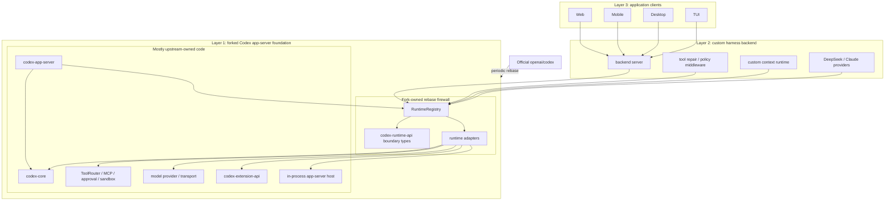

# Open Codex App-Server Foundation

This fork turns the Codex app-server into a reusable Layer 1 foundation for
custom agent harness backends.

The goal is to let downstream backends reuse Codex's thread, turn, tool,
sandbox, approval, event, and persistence machinery while installing their own
runtime behavior through narrow backend extension seams. The fork stays
general-purpose: DeepSeek-specific, Claude-specific, memory-product, or UI
behavior belongs in downstream Layer 2 and Layer 3 projects.

## Architecture



Codex app-server remains the owner of thread lifecycle, turn execution,
approval, sandbox, tool routing, event emission, and persistence. Layer 2 code
can opt into the new runtime surfaces to adapt model request bodies, contribute
and select context, observe final provider-bound input, repair tool calls, and
normalize usage metadata.

## What This Fork Adds

- `codex-runtime-api`: stable boundary types and traits for runtime extension
  capabilities.
- `RuntimeRegistry`: the composition point for one active implementation per
  runtime capability.
- `codex-app-server-sdk`: an embedding path for building a Layer 2 app-server
  that still uses the existing Codex app-server runtime.
- Runtime take-effect tests and CI gates that prove custom context, model
  request, tool repair, and usage behavior flow through app-server.

For the detailed SDK path, see
[Building a Layer 2 app-server with the SDK](./docs/layer2-app-server-sdk.md).

## Upstream Codex

This fork is based on [OpenAI Codex](https://github.com/openai/codex), a local
coding agent that can run in your terminal, IDE, or desktop app.

To install upstream Codex CLI on Mac or Linux:

```shell
curl -fsSL https://chatgpt.com/codex/install.sh | sh
```

To install upstream Codex CLI on Windows:

```powershell
powershell -ExecutionPolicy ByPass -c "irm https://chatgpt.com/codex/install.ps1 | iex"
```

Codex CLI can also be installed with npm or Homebrew:

```shell
npm install -g @openai/codex
brew install --cask codex
```

Run `codex` to get started with the CLI, or run `codex app` for the desktop app
experience.

## Documentation

- [Layer 2 app-server SDK](./docs/layer2-app-server-sdk.md)
- [Upstream Codex documentation](https://developers.openai.com/codex)
- [Contributing](./docs/contributing.md)
- [Installing and building](./docs/install.md)

This repository is licensed under the [Apache-2.0 License](LICENSE).
